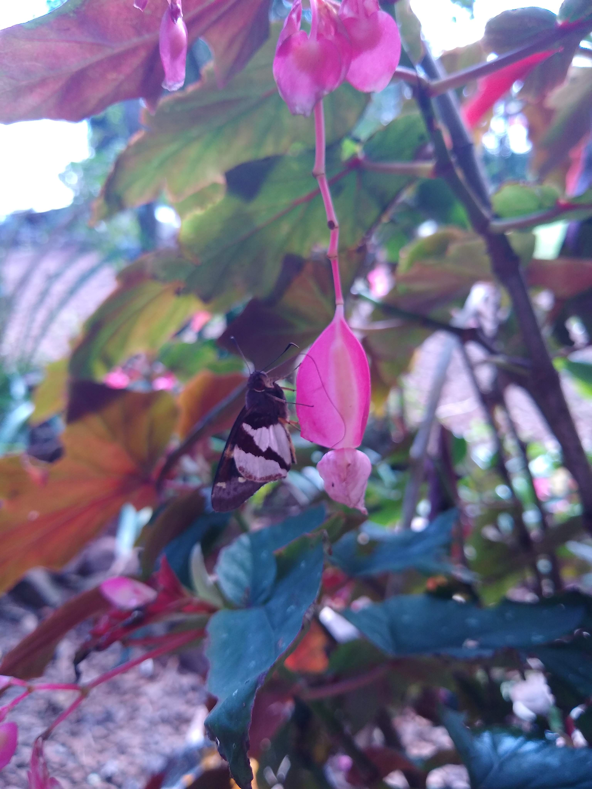

     
Nasci em uma pequena cidade do interior do Rio Grande do Sul chamada Tucunduva, onde meus pais tem um pequeno sítio em que desenvolvem atividades de agricultura familiar. Devido a isso, sempre tive muito contato com a natureza e aprendi a respeitá-la desde cedo. Me considero uma pessoa bastante comunicativa, proativa e com facilidade para trabahos em equipe, assim como uma profissional bastante dedicada.

---
### Trajetória Acadêmica  👩‍🎓

Iniciei minha trajetória acadêmica em 2011, quando ingressei na Universidade Federal de Pelotas no curso de Ciências Biológicas (bacharelado). Distante a uns 600km de casa, a UFPel me acolheu na graduação e também no mestrado em Biologia Animal. Em 2018, deixei Pelotas em direção à capital do estado, Porto Alegre, para obter meu diploma de doutora em Ecologia pela Universidade Federal do Rio Grande do Sul.   

Foi no final da graduação que as borboletas apareceram na minha vida, e foi com esse grupo diverso e carismático que desenvolvi minha pesquisa de dissertação e tese. Além disso, tive a felicidade de trabalhar nos dois biomas que cobrem a região sul do Brasil: Mata Atlântica 🌳 e Pampa 🌾. Usando especificamente a guilda de borboletas frugívoras (Nymphalidae), minha pesquisa buscou responder questões relacionada com ecologia de comunidades, focando principalemnte em como as distintas facetas da diversidade (taxonômica, filogenética e funcional) respondem aos gradientes ambientais.

Minha pesquisa está correlacionada as seguintes áreas:
- Processo de montagem de comunidade (community assembly processes)
- Modelos hierárquicos Bayesianos considerando a detecção impefeita
- Modelos de distribuição de espécies (Joint species distribution models - JSDM)
- Efeitos da história evolutiva e dos atributos funcionais na distribuição das espécies
- Relações entre padrões de diversidade e variáveis ambientais

Além da pesquisa, na pós-graduação pude aprimorar algumas habilidade (*soft skills*) como programação em R, visualização de dados (*ggplot*), manipulação e curadoria de grande conjunto de dados (*tidyverse*) e manipulação de objetos espaciais (*raster* e *shapefiles* no R e QGIS). Ainda, participei na elaboração e gerenciamento de projetos de pesquisa, liderando atividades de coleta de campo.

---
### Carreira Profissional  💼

Embora esse caminho ainda seja um pouco novo para mim, venho desenvolvendo trabalhos temporários nas áreas de consultoria ambiental e acessoria em análises de dados. Embora tenha um maior conhecimento sobre técnicas de coleta e amostragem de insetos, também tenho experiência como auxiliar de campo na coleta/amostragem de outros grupos, como aves, morcegos, anfíbios e répteis.

Tenho interesse nos cargos de:
* Biólogo
* Analista de dados
* Analista ambiental
* Assistente de campo

Tenho CRBio ativo (região 04) e disponibiliade para viajens. 
