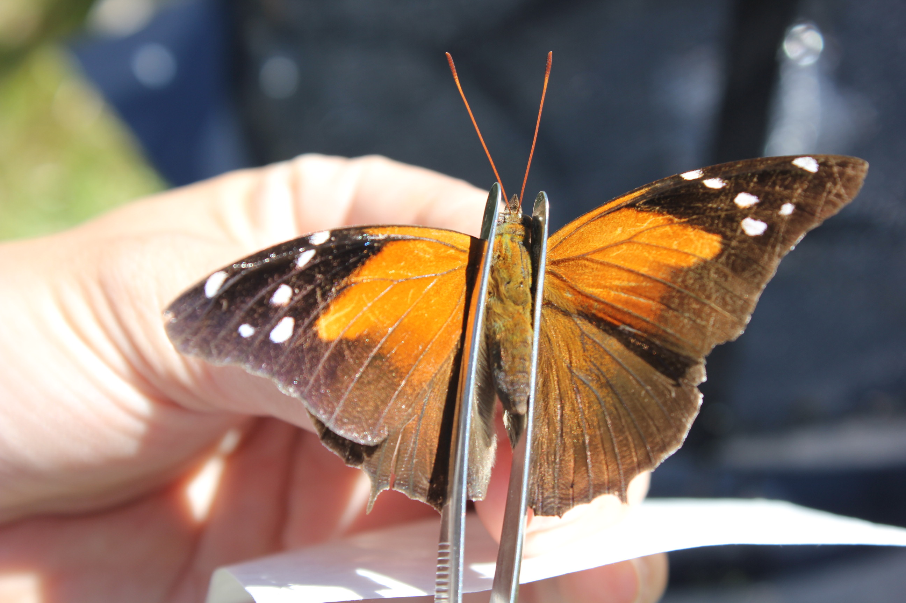
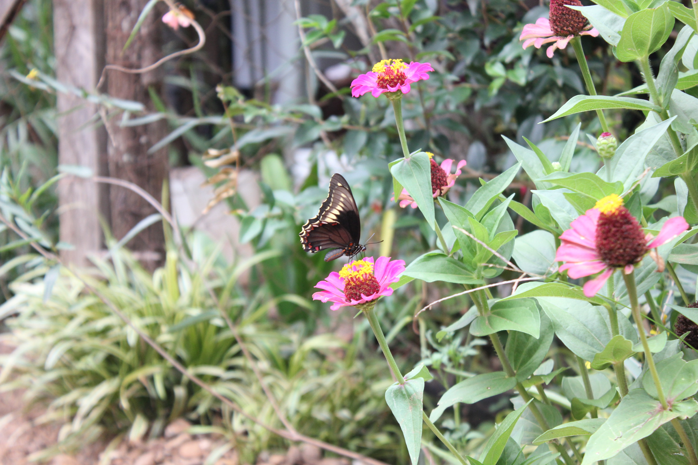
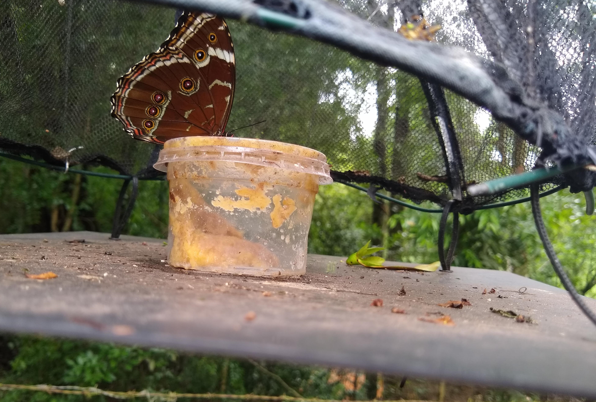

    
    
    

## Projetos no Power BI
[Projeto 1](https://app.powerbi.com/view?r=eyJrIjoiODY2NmEyMjEtNmVjYS00MjlhLTgzZWMtZmQyMWJlYjkyZGRiIiwidCI6ImRmNGVhNjRlLTc0NWYtNGU0Zi1iNTliLWFmODRiZjdkMjMwMyJ9) - Dashboard contendo dados de abundância de borboletas frugívoras (Nymphalidae) coletadas em distintos propriedades no Pampa gaúcho. 

## Projetos em Python
*em breve*
